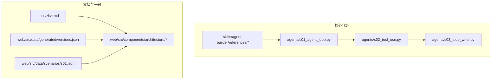
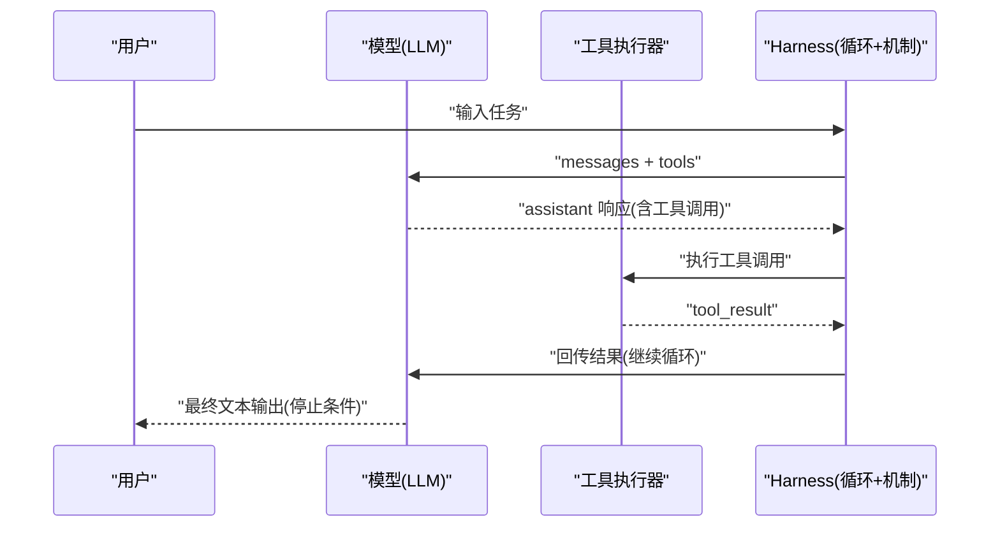
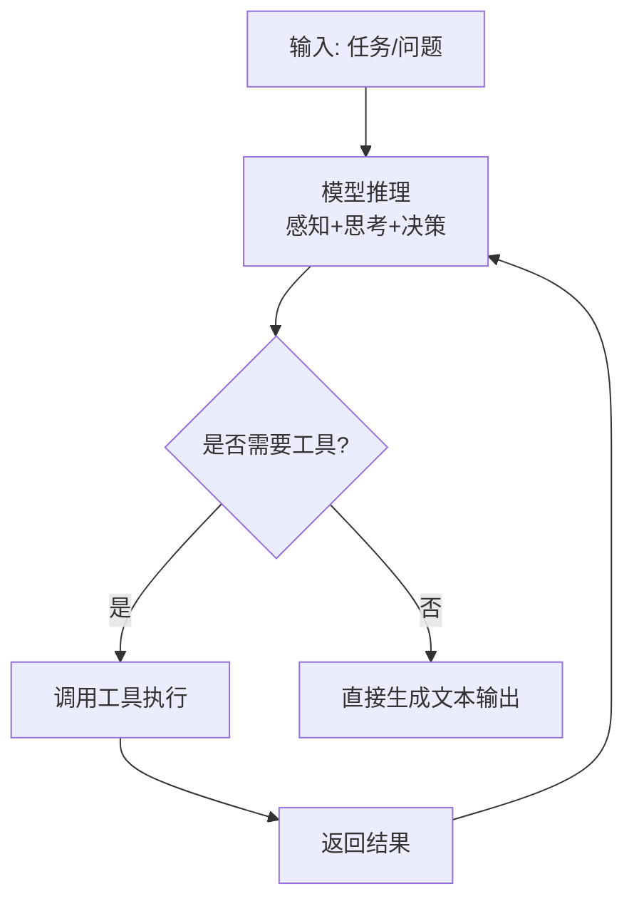
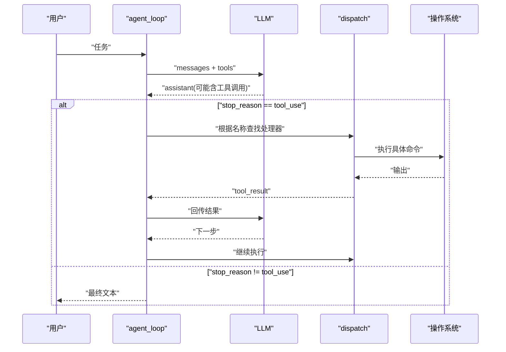
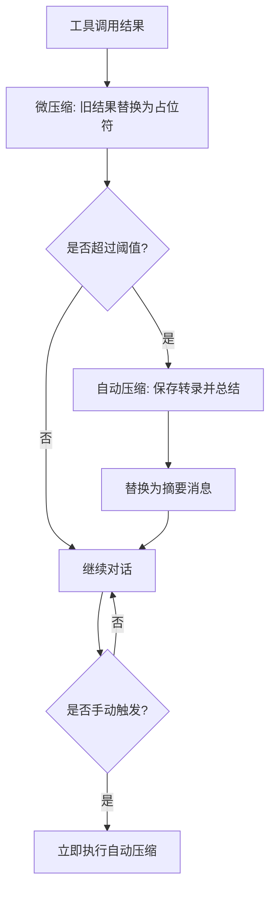
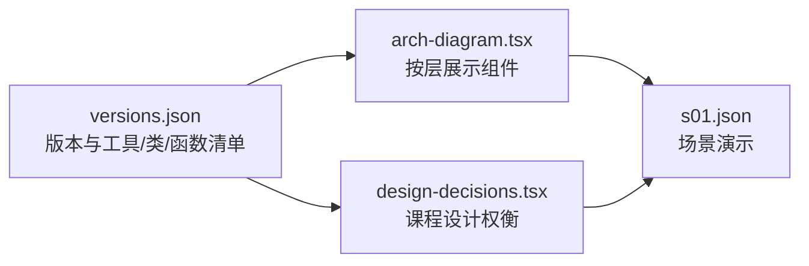

# 核心理念

<cite>
**本文引用的文件**
- [README.md](file://README.md)
- [README-zh.md](file://README-zh.md)
- [agent-philosophy.md](file://skills/agent-builder/references/agent-philosophy.md)
- [minimal-agent.py](file://skills/agent-builder/references/minimal-agent.py)
- [subagent-pattern.py](file://skills/agent-builder/references/subagent-pattern.py)
- [s01_agent_loop.py](file://agents/s01_agent_loop.py)
- [s02_tool_use.py](file://agents/s02_tool_use.py)
- [s03_todo_write.py](file://agents/s03_todo_write.py)
- [s01-the-agent-loop.md](file://docs/zh/s01-the-agent-loop.md)
- [s02-tool-use.md](file://docs/zh/s02-tool-use.md)
- [s03-todo-write.md](file://docs/zh/s03-todo-write.md)
- [versions.json](file://web/src/data/generated/versions.json)
- [arch-diagram.tsx](file://web/src/components/architecture/arch-diagram.tsx)
- [design-decisions.tsx](file://web/src/components/architecture/design-decisions.tsx)
- [s01.json](file://web/src/data/scenarios/s01.json)
</cite>

## 目录
1. [引言](#引言)
2. [项目结构](#项目结构)
3. [核心组件](#核心组件)
4. [架构总览](#架构总览)
5. [详细组件分析](#详细组件分析)
6. [依赖关系分析](#依赖关系分析)
7. [性能考量](#性能考量)
8. [故障排查指南](#故障排查指南)
9. [结论](#结论)
10. [附录](#附录)

## 引言
本节阐述 Learn Claude Code 的核心理念：“模型即代理，代码即工具箱”。我们将从代理的本质定义出发，对比传统框架、提示链与拖拽工作流，阐明真正的代理是经过训练的模型；随后引入 Harness 工程的概念，给出工具、知识、观察、行动接口与权限边界的五要素；最后通过历史里程碑事件证明“代理本质从未改变”，并总结从“开发代理”到“开发 Harness”的心智转变。

- 代理是神经网络，经数十亿次梯度更新训练，能感知环境、推理目标并采取行动。
- 代理不是框架、不是提示链、不是拖拽工作流；代理是模型本身。
- Harness 是模型在特定领域的“载体”：工具、知识、观察、行动接口与权限边界。
- 历史证明：DQN、OpenAI Five、AlphaStar、Jueyu、Claude 等里程碑均体现“agent = 模型”。

**章节来源**
- [README.md:4-29](file://README.md#L4-L29)
- [README-zh.md:5-29](file://README-zh.md#L5-L29)

## 项目结构
本仓库采用“渐进式课程 + 可视化平台”的组织方式：
- agents/: Python 参考实现，覆盖 s01–s12 的 12 个递进机制
- docs/{en,zh,ja}/: 多语言文档，配套课程讲解
- web/: Next.js 交互式学习平台，包含架构图、设计决策、场景演示
- skills/: 技能注入示例，用于按需加载知识
- GitHub Actions: CI 类型检查与构建

**图表来源**
- [s01_agent_loop.py:1-121](file://agents/s01_agent_loop.py#L1-L121)
- [s02_tool_use.py:1-151](file://agents/s02_tool_use.py#L1-L151)
- [s03_todo_write.py:1-212](file://agents/s03_todo_write.py#L1-L212)
- [versions.json:1-1015](file://web/src/data/generated/versions.json#L1-L1015)

**章节来源**
- [README.md:287-298](file://README.md#L287-L298)
- [README-zh.md:288-299](file://README-zh.md#L288-L299)

## 核心组件
- 代理循环（Agent Loop）
  - 最小循环：用户输入 → LLM 推理 → 工具调用 → 结果回传 → 直到 stop_reason != "tool_use"
  - s01 展示单工具 bash 的完整循环；s02 引入工具分发映射；s03 加入 Todo 管理与 nag 提醒
- 工具体系（Tools）
  - bash、read_file、write_file、edit_file 等；通过 TOOL_HANDLERS 映射到处理函数
  - 路径沙箱与危险命令拦截保障安全
- 计划与上下文（Planning & Context）
  - TodoManager 保持任务状态与顺序；nag 机制避免遗忘
  - s06 的三段式上下文压缩：微压缩、自动压缩、手动压缩
- 子代理与隔离（Subagents & Isolation）
  - s04 子代理使用独立 messages[]，避免主对话污染
- 技能注入（Skills）
  - s05 两层注入：系统提示中放技能元数据，工具结果中注入技能正文
- 团队与协作（Teams）
  - s09 文件型 JSONL 邮箱 + 持久化队友，支持异步通信与广播

**章节来源**
- [s01-the-agent-loop.md:1-119](file://docs/zh/s01-the-agent-loop.md#L1-L119)
- [s02-tool-use.md:1-102](file://docs/zh/s02-tool-use.md#L1-L102)
- [s03-todo-write.md:1-99](file://docs/zh/s03-todo-write.md#L1-L99)
- [s01_agent_loop.py:80-102](file://agents/s01_agent_loop.py#L80-L102)
- [s02_tool_use.py:94-131](file://agents/s02_tool_use.py#L94-L131)
- [s03_todo_write.py:163-193](file://agents/s03_todo_write.py#L163-L193)

## 架构总览
从“循环”到“机制”的演进路径：循环属于模型，机制属于 Harness。每一节课在既有循环上叠加一个 Harness 机制，而不改变循环本身。

**图表来源**
- [README.md:190-218](file://README.md#L190-L218)
- [README-zh.md:191-218](file://README-zh.md#L191-L218)

**章节来源**
- [README.md:190-218](file://README.md#L190-L218)
- [README-zh.md:191-218](file://README-zh.md#L191-L218)

## 详细组件分析

### 代理的本质：模型即代理
- 定义：神经网络（Transformer/RNN/学习函数），经数十亿次梯度更新，学会感知环境、推理目标、采取行动
- 人类、DQN、OpenAI Five、AlphaStar、Jueyu、Claude 都是“代理”，区别在于训练方式与任务域
- 误区：将“代理”等同于“框架/提示链/拖拽工作流”是错误的；真正的代理是模型

**图表来源**
- [README.md:10-29](file://README.md#L10-L29)
- [README-zh.md:11-29](file://README-zh.md#L11-L29)

**章节来源**
- [README.md:10-29](file://README.md#L10-L29)
- [README-zh.md:11-29](file://README-zh.md#L11-L29)

### 代理 vs. 传统框架/提示链/拖拽工作流
- 传统做法：if-else 分支、节点图、硬编码路由逻辑 → 鲁布·戈德堡机械
- 本质缺陷：无法通过工程手段获得“agency”；必须通过训练获得智能
- Learn Claude Code 的立场：循环不变，只加工具与机制；模型负责推理，Harness 负责执行与提供上下文

**章节来源**
- [README.md:30-41](file://README.md#L30-L41)
- [README-zh.md:31-41](file://README-zh.md#L31-L41)

### Harness 工程：工具、知识、观察、行动接口与权限边界
- 工具：文件 I/O、Shell、网络、数据库、浏览器等
- 知识：产品文档、API 规范、风格指南、技能文件等
- 观察：git diff、错误日志、浏览器状态、传感器数据等
- 行动：CLI 命令、API 调用、UI 交互等
- 权限：沙箱隔离、审批流程、信任边界
- 价值：模型做决策，Harness 执行；模型推理，Harness 提供上下文

**章节来源**
- [README.md:50-64](file://README.md#L50-L64)
- [README-zh.md:51-65](file://README-zh.md#L51-L65)
- [agent-philosophy.md:29-70](file://skills/agent-builder/references/agent-philosophy.md#L29-L70)

### 历史案例：代理本质从未改变
- 2013：DeepMind DQN 玩 Atari，单一神经网络从像素与得分学习玩多个游戏
- 2019：OpenAI Five 征服 Dota 2，五神经网络通过自博弈学会团队协作
- 2019：DeepMind AlphaStar 制霸星际争霸 II，实时策略、不完全信息下的顶级表现
- 2019：腾讯 Jueyu 击败 KPL 职业选手，高强度自博弈掌握 MOBA
- 2024-2025：LLM 代理重塑软件工程，Claude/GPT/Gemini 作为“代码代理”在真实环境中工作
- 结论：agent = 模型；周围代码 ≠ agent

**章节来源**
- [README.md:16-29](file://README.md#L16-L29)
- [README-zh.md:17-29](file://README-zh.md#L17-L29)

### 从“开发代理”到“开发 Harness”的心智转变
- “开发代理”可能指两类工作：
  1) 训练模型（权重调整、数据收集、强化学习/微调）
  2) 构建 Harness（为模型提供环境与机制）
- 本仓库聚焦后者：实现工具、策划知识、管理上下文、控制权限、收集任务过程数据
- 启示：造好 Harness，Agent 会完成剩下的

**章节来源**
- [README.md:42-84](file://README.md#L42-L84)
- [README-zh.md:43-85](file://README-zh.md#L43-L85)

### 代理循环与工具分发：s01 → s02 → s03
- s01：单工具 bash 的最小循环，验证“循环 + 工具 = 代理”
- s02：引入工具分发映射 TOOL_HANDLERS，新增 read_file/write_file/edit_file，并加入路径沙箱
- s03：加入 TodoManager 与 nag 机制，强制有序执行与进度追踪

**图表来源**
- [s01_agent_loop.py:80-102](file://agents/s01_agent_loop.py#L80-L102)
- [s02_tool_use.py:114-132](file://agents/s02_tool_use.py#L114-L132)
- [s03_todo_write.py:163-193](file://agents/s03_todo_write.py#L163-L193)

**章节来源**
- [s01-the-agent-loop.md:1-95](file://docs/zh/s01-the-agent-loop.md#L1-L95)
- [s02-tool-use.md:1-78](file://docs/zh/s02-tool-use.md#L1-L78)
- [s03-todo-write.md:1-77](file://docs/zh/s03-todo-write.md#L1-L77)

### 子代理与上下文隔离：s04 与 s06
- s04：子代理使用独立 messages[]，过滤工具集合，仅返回摘要给父代理，避免上下文污染
- s06：三段式上下文压缩
  - 微压缩：保留最近若干条工具结果摘要
  - 自动压缩：超过阈值时保存转录并请求 LLM 总结，替换历史消息
  - 手动压缩：模型显式触发压缩

**图表来源**
- [s04_subagent.py:119-217](file://skills/agent-builder/references/subagent-pattern.py#L119-L217)
- [s06_context_compact.py:286-334](file://agents/s06_context_compact.py#L286-L334)

**章节来源**
- [s04_subagent.py:1-244](file://skills/agent-builder/references/subagent-pattern.py#L1-L244)
- [s06_context_compact.py:1-205](file://agents/s06_context_compact.py#L1-L205)

### 技能注入与知识管理：s05
- 两层注入策略
  - 第一层（廉价）：在系统提示中列出可用技能名称与简述（约 100 token/技能）
  - 第二层（按需）：模型调用 load_skill 时，工具结果返回完整技能正文
- 优势：避免系统提示膨胀，按需加载知识

**章节来源**
- [s05_skill_loading.py:1-187](file://agents/s05_skill_loading.py#L1-L187)
- [agent-philosophy.md:45-52](file://skills/agent-builder/references/agent-philosophy.md#L45-L52)

### 团队与协作：s09
- 持久化队友 + 文件型 JSONL 邮箱
- 通信协议：message、broadcast、shutdown_request、shutdown_response、plan_approval_response
- 价值：模型间异步协作，突破单代理能力边界

**章节来源**
- [s09_agent_teams.py:1-348](file://agents/s09_agent_teams.py#L1-L348)

### 从“最小代理模板”到“完整 Harness”
- 最小代理模板（minimal-agent.py）展示 3 个工具 + 循环的最小可行代理
- 逐步叠加机制：工具扩展、计划、上下文压缩、子代理、技能、任务、后台任务、团队、权限治理
- 课程目标：理解“循环属于模型，机制属于 Harness”

**章节来源**
- [minimal-agent.py:1-150](file://skills/agent-builder/references/minimal-agent.py#L1-L150)
- [README.md:161-163](file://README.md#L161-L163)
- [README-zh.md:162-163](file://README-zh.md#L162-L163)

## 依赖关系分析
- 版本数据（versions.json）记录每个课程引入的工具、类、函数与分层（tools/planning/memory/concurrency/collaboration）
- 架构图组件（arch-diagram.tsx）按层显示类的引入顺序与颜色标识
- 设计决策（design-decisions.tsx）展示每节课的设计权衡与替代方案

**图表来源**
- [versions.json:1-1015](file://web/src/data/generated/versions.json#L1-L1015)
- [arch-diagram.tsx:1-229](file://web/src/components/architecture/arch-diagram.tsx#L1-L229)
- [design-decisions.tsx:1-148](file://web/src/components/architecture/design-decisions.tsx#L1-L148)
- [s01.json:1-52](file://web/src/data/scenarios/s01.json#L1-L52)

**章节来源**
- [versions.json:1-1015](file://web/src/data/generated/versions.json#L1-L1015)
- [arch-diagram.tsx:1-229](file://web/src/components/architecture/arch-diagram.tsx#L1-L229)
- [design-decisions.tsx:1-148](file://web/src/components/architecture/design-decisions.tsx#L1-L148)
- [s01.json:1-52](file://web/src/data/scenarios/s01.json#L1-L52)

## 性能考量
- 上下文压缩
  - 微压缩：降低历史冗余，减少 token 使用
  - 自动压缩：超过阈值时触发，避免超出上下文限制
  - 手动压缩：模型主动压缩，提升长期会话稳定性
- 并发与后台任务
  - 后台线程执行耗时任务，主线程继续推理，提高吞吐
- 工具与权限
  - 路径沙箱与危险命令拦截，减少失败重试与安全风险
  - 读写分离与只读子代理，降低误操作概率

[本节为通用指导，无需特定文件引用]

## 故障排查指南
- 循环未停止
  - 检查 stop_reason 是否为 "tool_use"；若模型未调用工具，循环自然结束
- 工具调用失败
  - 查看 TOOL_HANDLERS 中对应名称是否存在；确认输入 schema 与参数类型
  - 检查路径是否越权（safe_path）、命令是否被拦截
- 上下文溢出
  - 启用微压缩与自动压缩；必要时手动触发压缩
- 子代理无输出
  - 确认子代理 messages[] 是否为空；检查工具过滤与权限设置
- 团队通信异常
  - 检查 JSONL 邮箱文件是否存在与可写；确认消息类型是否在允许集合中

**章节来源**
- [s01_agent_loop.py:80-102](file://agents/s01_agent_loop.py#L80-L102)
- [s02_tool_use.py:94-131](file://agents/s02_tool_use.py#L94-L131)
- [s06_context_compact.py:286-334](file://agents/s06_context_compact.py#L286-L334)
- [s04_subagent.py:119-217](file://skills/agent-builder/references/subagent-pattern.py#L119-L217)
- [s09_agent_teams.py:1-348](file://agents/s09_agent_teams.py#L1-L348)

## 结论
- 代理 = 模型；代码 = Harness
- Harness 的价值在于：为模型提供清晰的感知、精确的行动与丰富的知识
- 从“开发代理”到“开发 Harness”的转变，是工程重心从“编程智能”转向“构建世界”的根本跃迁
- 通过 12 个课程，Learn Claude Code 展示了如何在不改变核心循环的前提下，层层叠加机制，最终形成可复用、可扩展、可治理的代理 Harness

[本节为总结，无需特定文件引用]

## 附录
- 术语对照
  - 代理：经过训练的模型，能感知、推理、行动
  - Harness：模型在特定领域的载体，包含工具、知识、观察、行动接口与权限边界
  - 循环：agent_loop，模型与真实世界交互的最小闭环
- 学习建议
  - 从 s01 开始，逐步叠加机制
  - 关注“循环不变，只加机制”的设计原则
  - 将“模型负责推理，Harness 负责执行”作为工程判断标准

[本节为补充说明，无需特定文件引用]