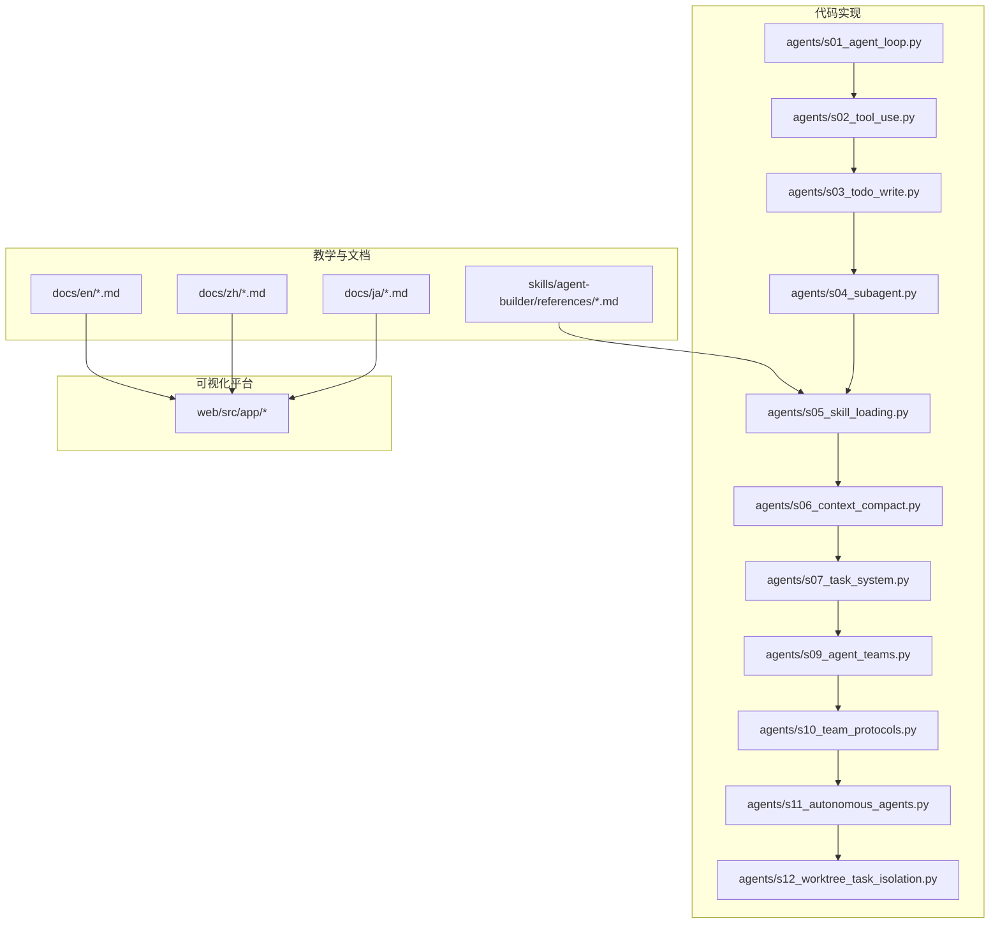
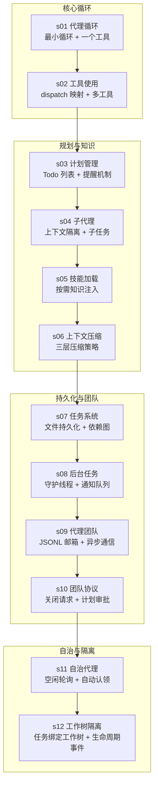
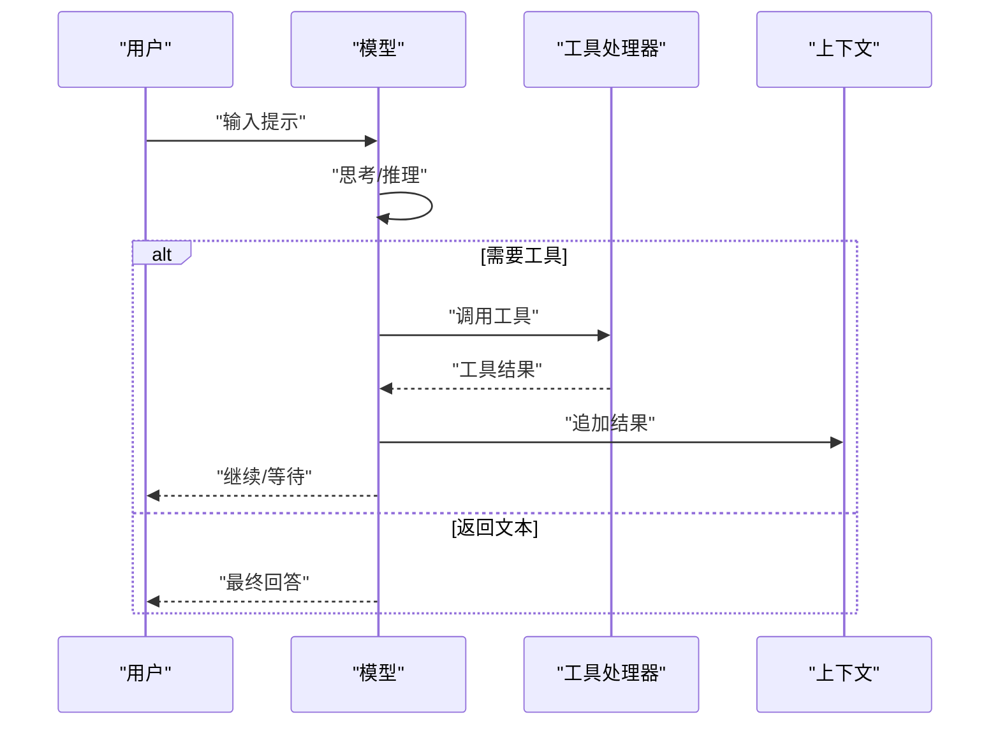
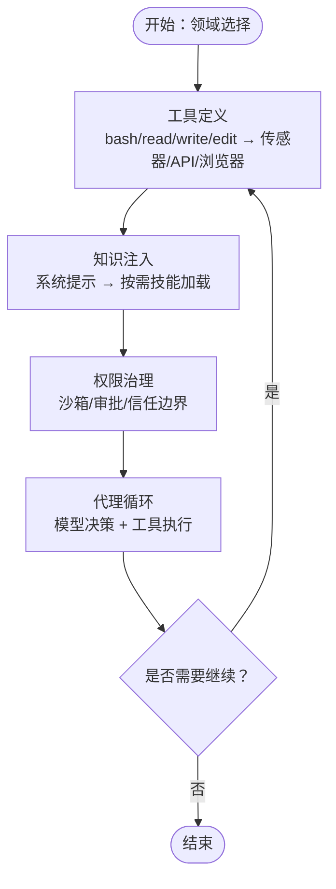
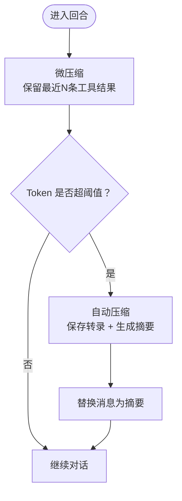
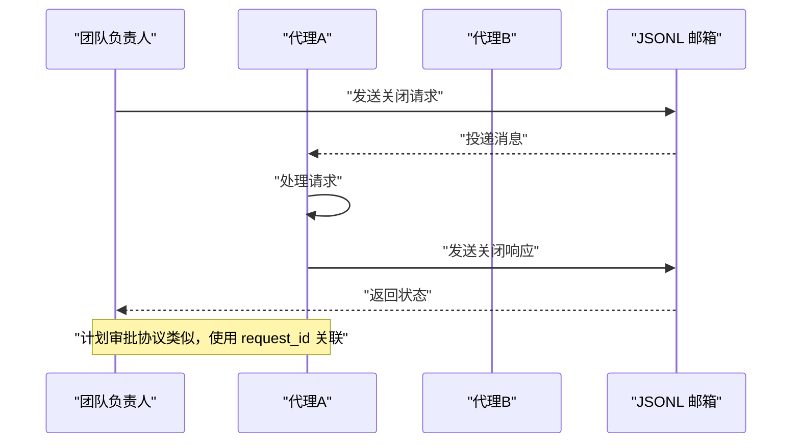
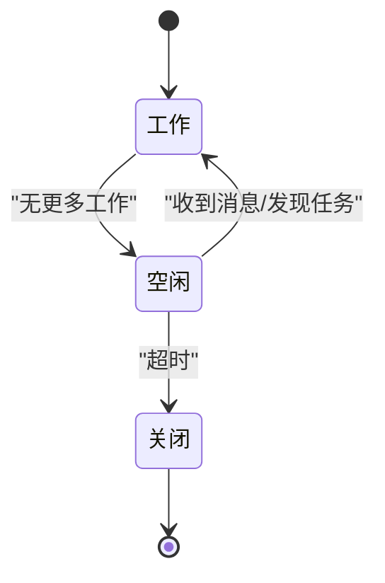
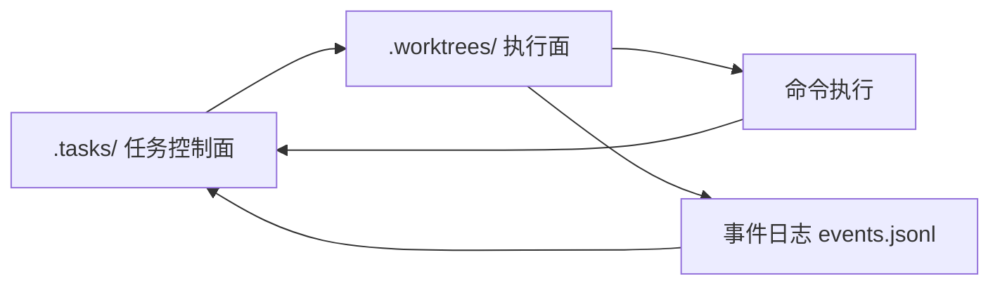
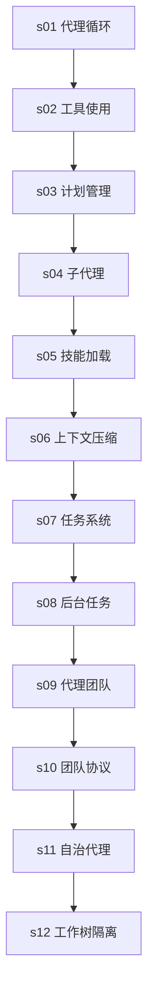
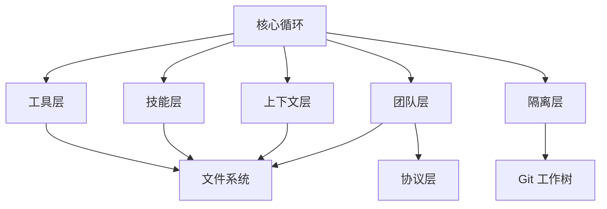

# 项目愿景

<cite>
**本文引用的文件**
- [README.md](file://README.md)
- [README-zh.md](file://README-zh.md)
- [agent-philosophy.md](file://skills/agent-builder/references/agent-philosophy.md)
- [s01_agent_loop.py](file://agents/s01_agent_loop.py)
- [s02_tool_use.py](file://agents/s02_tool_use.py)
- [s03_todo_write.py](file://agents/s03_todo_write.py)
- [s04_subagent.py](file://agents/s04_subagent.py)
- [s05_skill_loading.py](file://agents/s05_skill_loading.py)
- [s06_context_compact.py](file://agents/s06_context_compact.py)
- [s07_task_system.py](file://agents/s07_task_system.py)
- [s09_agent_teams.py](file://agents/s09_agent_teams.py)
- [s10_team_protocols.py](file://agents/s10_team_protocols.py)
- [s11_autonomous_agents.py](file://agents/s11_autonomous_agents.py)
- [s12_worktree_task_isolation.py](file://agents/s12_worktree_task_isolation.py)
- [page.tsx](file://web/src/app/[locale]/(learn)/[version]/page.tsx)
</cite>

## 目录
1. [引言](#引言)
2. [项目结构](#项目结构)
3. [核心组件](#核心组件)
4. [架构总览](#架构总览)
5. [详细组件分析](#详细组件分析)
6. [依赖关系分析](#依赖关系分析)
7. [性能考量](#性能考量)
8. [故障排查指南](#故障排查指南)
9. [结论](#结论)
10. [附录](#附录)

## 引言
Learn Claude Code 项目以“为真实智能体填充宇宙”为宏大愿景，旨在通过可复用的“代理工程”模式，将 Claude Code 的通用架构从软件工程推广到农业、酒店运营、医疗研究、制造业、教育、科学研究等广泛领域。项目强调“模型即代理，代码即 Harness”的心智转变，通过渐进式课程（s01–s12）层层叠加“Harness 机制”，在不改变核心代理循环的前提下，为不同领域构建通用的“载具”。

本愿景不仅是技术路线图，更是教育使命：培养 Harness 工程师，构建智能自动化未来。项目通过对工具、知识、上下文、权限与团队协作的系统化抽象，推动 AI 代理在真实世界中的规模化落地。

**章节来源**
- [README.md: 114-136:114-136](file://README.md#L114-L136)
- [README-zh.md: 115-136:115-136](file://README-zh.md#L115-L136)

## 项目结构
项目采用“渐进式课程 + 可视化学习平台”的双轨结构：
- agents/：Python 参考实现，覆盖从基础代理循环到工作树隔离的完整演进（s01–s12）
- docs/{en,zh,ja}/：多语言文档，配套 mental-model-first 教学材料
- web/：Next.js 交互式学习平台，展示执行流程、可视化与源码浏览
- skills/：按需技能加载的参考实现，支撑 s05 的知识注入机制

**图表来源**
- [README.md: 287-298:287-298](file://README.md#L287-L298)
- [README-zh.md: 288-298:288-298](file://README-zh.md#L288-L298)

**章节来源**
- [README.md: 287-298:287-298](file://README.md#L287-L298)
- [README-zh.md: 288-298:288-298](file://README-zh.md#L288-L298)

## 核心组件
- 代理循环（Agent Loop）：贯穿始终的最小循环，模型决定何时调用工具、何时返回文本；代码负责执行工具调用并将结果回灌至上下文。
- 工具（Tools）：原子化、可组合的动作接口，如 bash、文件读写、编辑等；通过 dispatch 映射到处理器。
- 知识（Skills）：按需加载的领域知识，避免系统提示膨胀；通过 tool_result 注入，支持渐进披露。
- 上下文（Context）：通过微压缩、自动压缩与手动压缩三层策略，保障无限会话下的内存健康。
- 任务（Tasks）：持久化任务图，支持依赖关系与跨会话状态，为多代理协作奠定基础。
- 团队（Teams）：基于 JSONL 邮箱的异步通信，支持关闭请求、计划审批等协议。
- 自治（Autonomy）：空闲轮询、自动认领未占用任务，实现无需人工干预的持续工作。
- 隔离（Isolation）：以任务为中心的控制面与以工作树为中心的执行面分离，实现并行执行与安全隔离。

**章节来源**
- [README.md: 190-218:190-218](file://README.md#L190-L218)
- [README-zh.md: 191-218:191-218](file://README-zh.md#L191-L218)

## 架构总览
下图展示了从单一代理循环到工作树隔离的完整演进路径，体现“工具变化、知识变化、权限变化，但代理模式保持一致”的跨领域适用性。

**图表来源**
- [README.md: 256-285:256-285](file://README.md#L256-L285)
- [README-zh.md: 255-286:255-286](file://README-zh.md#L255-L286)

**章节来源**
- [README.md: 256-285:256-285](file://README.md#L256-L285)
- [README-zh.md: 255-286:255-286](file://README-zh.md#L255-L286)

## 详细组件分析

### 代理循环与通用模式
- 最小循环：模型在每次迭代中决定是否调用工具；若调用工具，则执行并回灌结果，直至模型决定停止。
- 通用模式：s01–s12 的每一节均在此循环之上叠加一个 Harness 机制，循环属于模型，机制属于 Harness。

**图表来源**
- [README.md: 190-218:190-218](file://README.md#L190-L218)
- [README-zh.md: 191-218:191-218](file://README-zh.md#L191-L218)

**章节来源**
- [README.md: 190-218:190-218](file://README.md#L190-L218)
- [README-zh.md: 191-218:191-218](file://README-zh.md#L191-L218)

### 工具与技能：从软件工程到跨领域
- 工具层面：s02–s05 展示了从单一 bash 工具到多工具 dispatch、再到按需技能加载的知识注入。
- 领域迁移：工具变化（如 read/write → 传感器接入）、知识变化（如代码文档 → 农业知识）、权限变化（如只读 → 受控写入）均通过 Harness 机制实现，代理模式保持一致。

**图表来源**
- [README.md: 114-136:114-136](file://README.md#L114-L136)
- [README-zh.md: 115-136:115-136](file://README-zh.md#L115-L136)

**章节来源**
- [README.md: 114-136:114-136](file://README.md#L114-L136)
- [README-zh.md: 115-136:115-136](file://README-zh.md#L115-L136)

### 上下文压缩与无限会话
- 微压缩：保留最近若干工具结果，其余用占位符替代，减少 token 使用。
- 自动压缩：超过阈值时触发，保存转录并生成摘要替换消息。
- 手动压缩：模型主动请求压缩，立即执行摘要流程。

**图表来源**
- [s06_context_compact.py: 68-127:68-127](file://agents/s06_context_compact.py#L68-L127)

**章节来源**
- [s06_context_compact.py: 68-127:68-127](file://agents/s06_context_compact.py#L68-L127)

### 任务系统与多代理协作
- 任务持久化：以 JSON 文件形式存储任务状态与依赖关系，支持跨会话恢复。
- 团队通信：基于 JSONL 邮箱的异步消息传递，支持广播、关闭请求与计划审批协议。
- 协议一致性：通过 request_id 关联的请求-响应模式，确保跨代理的一致性与可追踪性。

**图表来源**
- [s09_agent_teams.py: 77-120:77-120](file://agents/s09_agent_teams.py#L77-L120)
- [s10_team_protocols.py: 87-131:87-131](file://agents/s10_team_protocols.py#L87-L131)

**章节来源**
- [s09_agent_teams.py: 77-120:77-120](file://agents/s09_agent_teams.py#L77-L120)
- [s10_team_protocols.py: 87-131:87-131](file://agents/s10_team_protocols.py#L87-L131)

### 自治代理与空闲轮询
- 空闲轮询：代理在完成当前工作后进入空闲状态，周期性检查消息与未占用任务。
- 自动认领：扫描任务板，找到未被占用且无阻塞的任务，自动认领并继续工作。
- 身份注入：在上下文压缩后重新注入身份块，确保连续性。

**图表来源**
- [s11_autonomous_agents.py: 167-304:167-304](file://agents/s11_autonomous_agents.py#L167-L304)

**章节来源**
- [s11_autonomous_agents.py: 167-304:167-304](file://agents/s11_autonomous_agents.py#L167-L304)

### 工作树隔离与并行执行
- 控制面（任务）：集中管理任务状态、所有者与工作树绑定。
- 执行面（工作树）：以 Git worktree 为隔离单元，支持并行执行与安全回滚。
- 生命周期可观测：通过事件日志记录创建、移除、保留等关键事件，便于审计与排障。

**图表来源**
- [s12_worktree_task_isolation.py: 121-221:121-221](file://agents/s12_worktree_task_isolation.py#L121-L221)

**章节来源**
- [s12_worktree_task_isolation.py: 121-221:121-221](file://agents/s12_worktree_task_isolation.py#L121-L221)

### 教育使命与学习路径
- 渐进式学习：s01–s12 每节课聚焦一个 Harness 机制，形成“从简单循环到隔离化自治执行”的完整路径。
- 可视化平台：web 平台提供交互式可视化、源码查看与分步讲解，加速理解与实践。
- 产品化延伸：课程结束后可将知识落地为 CLI 或 SDK，支撑实际业务场景。

**图表来源**
- [README.md: 256-285:256-285](file://README.md#L256-L285)
- [README-zh.md: 255-286:255-286](file://README-zh.md#L255-L286)

**章节来源**
- [README.md: 256-285:256-285](file://README.md#L256-L285)
- [README-zh.md: 255-286:255-286](file://README-zh.md#L255-L286)
- [page.tsx: 44-82](file://web/src/app/[locale]/(learn)/[version]/page.tsx#L44-L82)

## 依赖关系分析
- 低耦合高内聚：每个课程仅引入一个新机制，避免复杂度叠加；核心循环保持稳定。
- 外部依赖：Anthropic 客户端、Git（用于工作树隔离）、文件系统（用于任务与技能持久化）。
- 可观测性：事件总线与日志记录贯穿执行面，便于监控与排障。

**图表来源**
- [s12_worktree_task_isolation.py: 224-236:224-236](file://agents/s12_worktree_task_isolation.py#L224-L236)

**章节来源**
- [s12_worktree_task_isolation.py: 224-236:224-236](file://agents/s12_worktree_task_isolation.py#L224-L236)

## 性能考量
- Token 控制：通过三层压缩策略降低上下文长度，避免超出模型上下文窗口。
- 并行执行：工作树隔离支持并行任务，提升吞吐；同时通过事件日志与锁机制避免竞态。
- 资源限制：对危险命令进行拦截，设置超时与输出截断，防止资源耗尽。
- 可扩展性：协议与工具接口保持稳定，新增领域只需替换工具与知识，不改变核心循环。

[本节为通用指导，无需具体文件分析]

## 故障排查指南
- 工具执行失败：检查危险命令拦截、超时与权限配置；确认工具输入 schema 与参数类型匹配。
- 上下文溢出：触发自动压缩或手动压缩；检查微压缩策略是否生效。
- 团队通信异常：检查 JSONL 邮箱路径与消息类型有效性；确认 request_id 关联正确。
- 工作树问题：确认 Git 环境可用；检查工作树名称合法性与索引一致性；查看事件日志定位错误。

**章节来源**
- [s06_context_compact.py: 102-127:102-127](file://agents/s06_context_compact.py#L102-L127)
- [s09_agent_teams.py: 87-120:87-120](file://agents/s09_agent_teams.py#L87-L120)
- [s12_worktree_task_isolation.py: 237-248:237-248](file://agents/s12_worktree_task_isolation.py#L237-L248)

## 结论
Learn Claude Code 的愿景不仅是“为真实智能体填充宇宙”，更是通过可复用的 Harness 工程模式，将 Claude Code 的通用架构推广到千行万业。项目以“模型即代理，代码即 Harness”的理念，通过 s01–s12 的渐进式课程，系统化解构工具、知识、上下文、权限、团队与隔离等关键机制，形成一套可迁移、可扩展、可教学的“代理工程”方法论。其教育使命在于培养 Harness 工程师，构建智能自动化未来，推动 AI 代理在真实世界中的规模化落地与长期演进。

[本节为总结性内容，无需具体文件分析]

## 附录
- 术语对照
  - 代理：经训练的模型，具备感知、推理与行动能力
  - Harness：为代理提供环境与能力的载体，包含工具、知识、观察、动作接口与权限
  - 技能：按需注入的领域知识，通过 tool_result 注入，避免系统提示膨胀
  - 工作树：Git 工作树隔离执行面，支持并行与安全回滚
  - 协议：基于 request_id 的请求-响应模式，确保跨代理一致性

[本节为补充说明，无需具体文件分析]