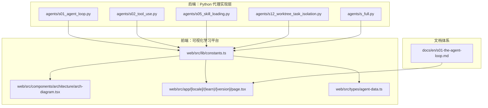
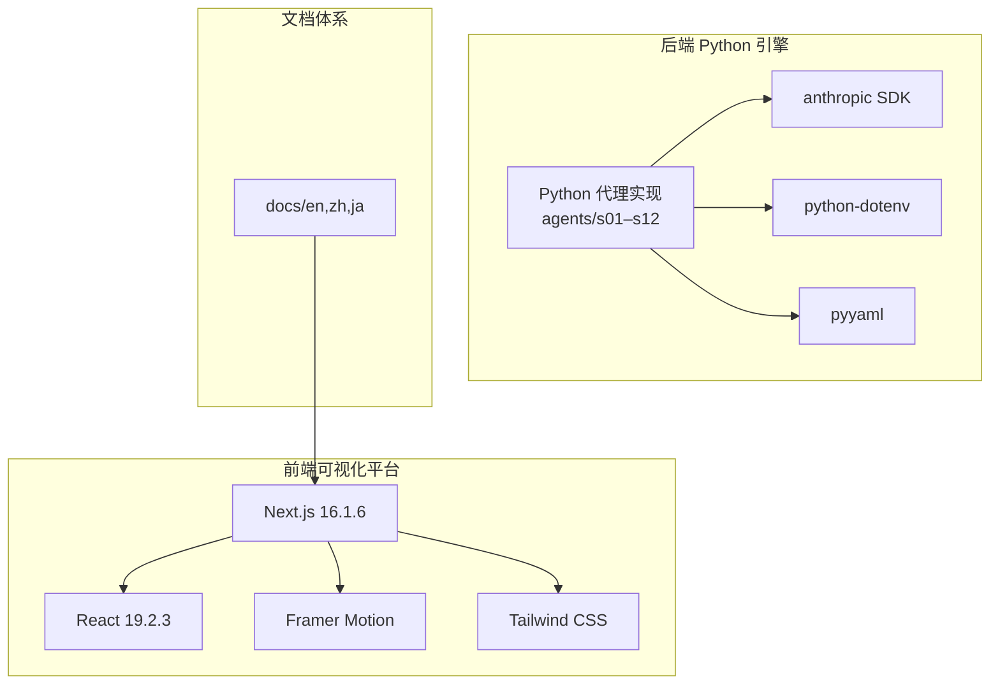
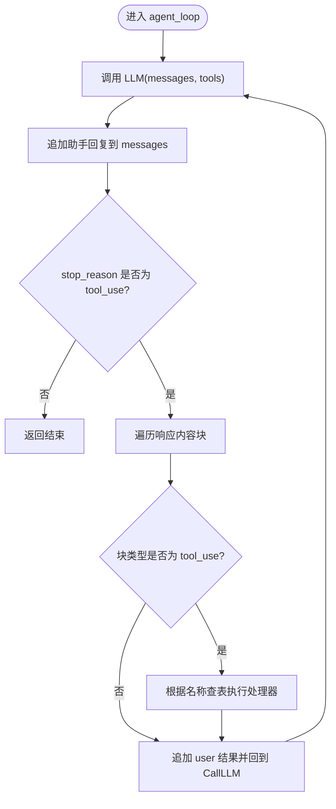
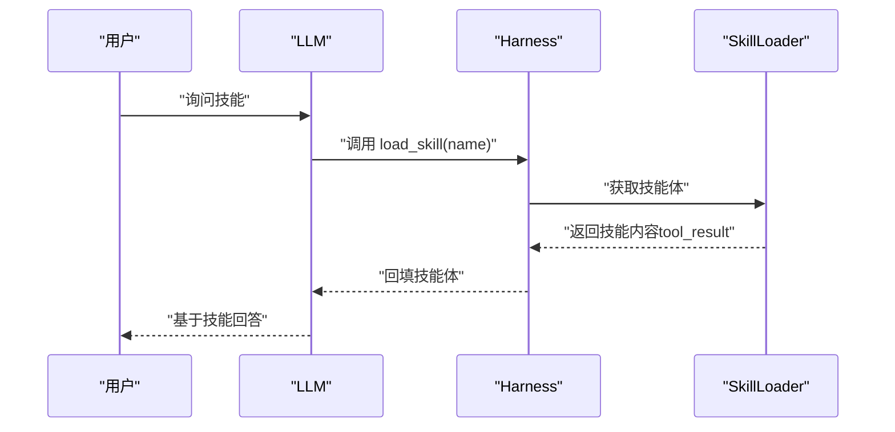
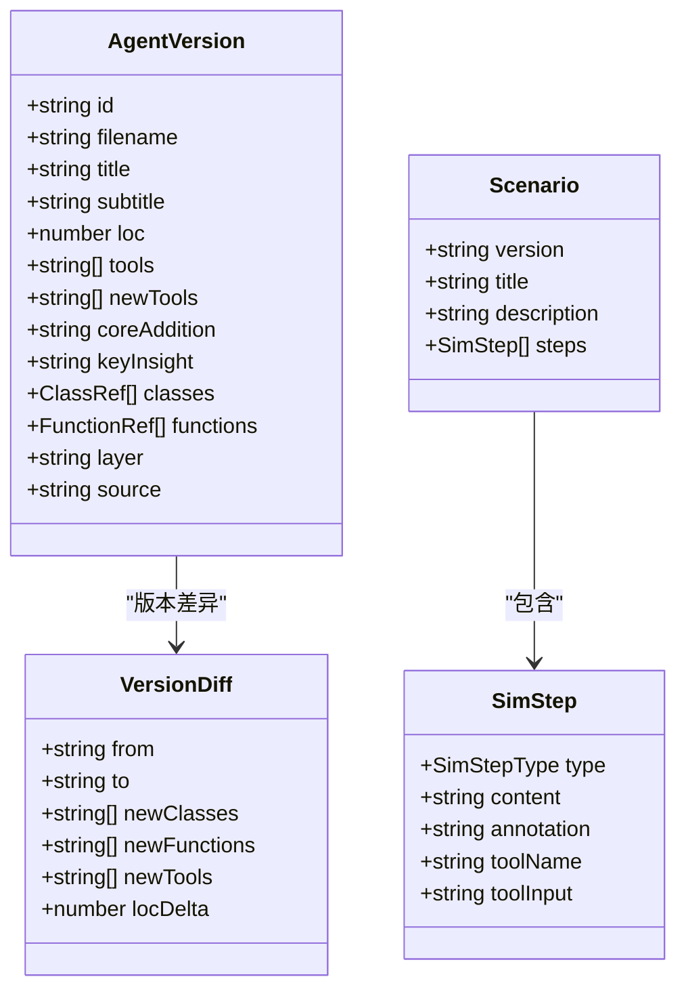
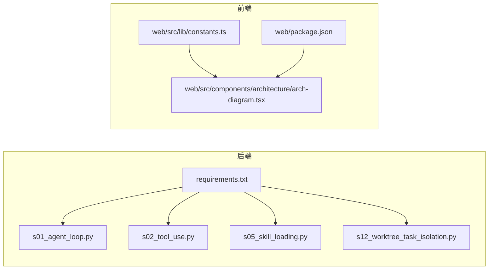

# 项目架构

<cite>
**本文引用的文件**
- [README.md](file://README.md)
- [README-zh.md](file://README-zh.md)
- [requirements.txt](file://requirements.txt)
- [package.json](file://web/package.json)
- [agents/__init__.py](file://agents/__init__.py)
- [agents/s01_agent_loop.py](file://agents/s01_agent_loop.py)
- [agents/s02_tool_use.py](file://agents/s02_tool_use.py)
- [agents/s05_skill_loading.py](file://agents/s05_skill_loading.py)
- [agents/s12_worktree_task_isolation.py](file://agents/s12_worktree_task_isolation.py)
- [web/src/lib/constants.ts](file://web/src/lib/constants.ts)
- [web/src/components/architecture/arch-diagram.tsx](file://web/src/components/architecture/arch-diagram.tsx)
- [web/src/app/[locale]/(learn)/[version]/page.tsx](file://web/src/app/[locale]/(learn)/[version]/page.tsx)
- [web/src/types/agent-data.ts](file://web/src/types/agent-data.ts)
- [docs/en/s01-the-agent-loop.md](file://docs/en/s01-the-agent-loop.md)
</cite>

## 目录
1. [引言](#引言)
2. [项目结构](#项目结构)
3. [核心组件](#核心组件)
4. [架构总览](#架构总览)
5. [详细组件分析](#详细组件分析)
6. [依赖关系分析](#依赖关系分析)
7. [性能考量](#性能考量)
8. [故障排查指南](#故障排查指南)
9. [结论](#结论)
10. [附录](#附录)

## 引言
Learn Claude Code 是一个渐进式教学项目，围绕“代理循环”这一核心模式，通过 12 个 session（s01–s12）逐步叠加 Harness 机制，展示如何为 Claude 模型构建高效的工程化“马车”。项目强调“模型是代理，代码是 Harness”的理念：模型负责决策与推理，Harness 负责提供工具、知识、上下文管理与权限边界。

项目采用全栈教育应用架构：
- 后端：Python 代理实现层（agents/），包含 s01–s12 的渐进式参考实现与 s_full 总结
- 前端：Next.js 16.1.6 + React 19.2.3 可视化学习平台（web/）
- 教学文档：英文/中文/日文三语文档（docs/）
- 技术栈：anthropic SDK、python-dotenv、pyyaml、Framer Motion、Tailwind CSS

## 项目结构
项目采用模块化分层组织：
- agents/：Python 代理实现层（s01–s12 渐进式版本 + s_full 总结）
- docs/{en,zh,ja}/：面向心智模型的教学文档
- skills/：按需加载的技能素材（SKILL.md）
- web/：交互式学习平台（Next.js 16.1.6 + React 19.2.3 + Framer Motion + Tailwind CSS）
- tests/：轻量级冒烟测试
- 根目录：README、requirements.txt、CI 工作流等

**图表来源**
- [agents/s01_agent_loop.py:1-121](file://agents/s01_agent_loop.py#L1-L121)
- [agents/s02_tool_use.py:1-151](file://agents/s02_tool_use.py#L1-L151)
- [agents/s05_skill_loading.py:1-228](file://agents/s05_skill_loading.py#L1-L228)
- [agents/s12_worktree_task_isolation.py:1-783](file://agents/s12_worktree_task_isolation.py#L1-L783)
- [web/src/lib/constants.ts:1-38](file://web/src/lib/constants.ts#L1-L38)
- [web/src/components/architecture/arch-diagram.tsx:1-229](file://web/src/components/architecture/arch-diagram.tsx#L1-L229)
- [web/src/app/[locale]/(learn)/[version]/page.tsx](file://web/src/app/[locale]/(learn)/[version]/page.tsx#L1-L126)
- [web/src/types/agent-data.ts:1-73](file://web/src/types/agent-data.ts#L1-L73)
- [docs/en/s01-the-agent-loop.md:1-117](file://docs/en/s01-the-agent-loop.md#L1-L117)

**章节来源**
- [README.md:287-298](file://README.md#L287-L298)
- [README-zh.md:288-299](file://README-zh.md#L288-L299)
- [agents/__init__.py:1-4](file://agents/__init__.py#L1-L4)

## 核心组件
- 代理循环（Agent Loop）：贯穿所有 session 的最小有效循环，模型决定是否调用工具，Harness 仅执行工具调用并回填结果
- 工具系统（Tools）：从单一 bash 工具扩展到多工具 dispatch 映射，保持循环不变
- 技能系统（Skills）：按需加载知识，避免系统提示膨胀
- 任务与上下文管理：从 TodoWrite 到 Context Compact，再到 Task System 与 Worktree 隔离
- 团队协作：Agent Teams → Team Protocols → Autonomous Agents → Worktree Isolation
- 可视化学习平台：版本导航、架构图、源码查看、交互式模拟器与时间线

**章节来源**
- [README.md:190-218](file://README.md#L190-L218)
- [README-zh.md:191-218](file://README-zh.md#L191-L218)
- [web/src/lib/constants.ts:9-29](file://web/src/lib/constants.ts#L9-L29)

## 架构总览
全栈教育应用采用“后端 Python 引擎 + 前端可视化平台 + 交互式教程”的模式：
- 后端 Python 引擎：agents/ 提供 s01–s12 的渐进式实现，每个文件自包含且可直接运行
- 前端可视化平台：Next.js 页面动态渲染版本详情、架构图、工具清单与交互式组件
- 文档体系：docs/ 提供三语教学文档，配合 web 平台进行讲解与演示

**图表来源**
- [requirements.txt:1-3](file://requirements.txt#L1-L3)
- [package.json:13-28](file://web/package.json#L13-L28)
- [README.md:287-298](file://README.md#L287-L298)

## 详细组件分析

### Python 代理实现层（s01–s12 渐进式版本）
- s01：单工具循环，模型 + 工具 + 结果回填，形成最小代理内核
- s02：引入工具 dispatch 映射，循环保持不变，新增工具注册
- s05：按需技能加载，两层注入避免系统提示膨胀
- s12：任务与工作树隔离，目录级并发执行，事件可观测

**图表来源**
- [agents/s01_agent_loop.py:81-101](file://agents/s01_agent_loop.py#L81-L101)
- [agents/s02_tool_use.py:114-131](file://agents/s02_tool_use.py#L114-L131)
- [agents/s05_skill_loading.py:188-208](file://agents/s05_skill_loading.py#L188-L208)
- [agents/s12_worktree_task_isolation.py:729-759](file://agents/s12_worktree_task_isolation.py#L729-L759)

**章节来源**
- [agents/s01_agent_loop.py:1-121](file://agents/s01_agent_loop.py#L1-L121)
- [agents/s02_tool_use.py:1-151](file://agents/s02_tool_use.py#L1-L151)
- [agents/s05_skill_loading.py:1-228](file://agents/s05_skill_loading.py#L1-L228)
- [agents/s12_worktree_task_isolation.py:1-783](file://agents/s12_worktree_task_isolation.py#L1-L783)

### 技能系统层（按需知识注入）
- 两层注入策略：系统提示中仅注入技能元信息（廉价），实际技能体在工具调用时以 tool_result 注入
- 技能目录结构：skills/<name>/SKILL.md，使用 YAML frontmatter 描述元数据
- 与代理循环解耦：工具调用触发，不影响核心循环

**图表来源**
- [agents/s05_skill_loading.py:58-107](file://agents/s05_skill_loading.py#L58-L107)
- [agents/s05_skill_loading.py:166-185](file://agents/s05_skill_loading.py#L166-L185)

**章节来源**
- [agents/s05_skill_loading.py:1-228](file://agents/s05_skill_loading.py#L1-L228)

### 可视化学习平台层（Next.js + React）
- 版本页面：动态生成静态参数，渲染版本元信息、工具清单、前后版本导航
- 架构图组件：按版本收集类与工具，高亮新增项，按层着色
- 数据模型：版本索引、差异、场景与仿真步骤等类型定义

**图表来源**
- [web/src/types/agent-data.ts:1-73](file://web/src/types/agent-data.ts#L1-L73)

**章节来源**
- [web/src/app/[locale]/(learn)/[version]/page.tsx](file://web/src/app/[locale]/(learn)/[version]/page.tsx#L1-L126)
- [web/src/components/architecture/arch-diagram.tsx:1-229](file://web/src/components/architecture/arch-diagram.tsx#L1-L229)
- [web/src/lib/constants.ts:1-38](file://web/src/lib/constants.ts#L1-L38)
- [web/src/types/agent-data.ts:1-73](file://web/src/types/agent-data.ts#L1-L73)

### 文档体系层（三语教学文档）
- 英文/中文/日文三语文档，围绕心智模型展开：问题、方案、ASCII 图、最小代码
- 与前端版本页面联动，提供深度讲解与示例

**章节来源**
- [README.md:299-318](file://README.md#L299-L318)
- [README-zh.md:300-318](file://README-zh.md#L300-L318)
- [docs/en/s01-the-agent-loop.md:1-117](file://docs/en/s01-the-agent-loop.md#L1-L117)

## 依赖关系分析
- 后端依赖：anthropic SDK（调用 Claude）、python-dotenv（环境变量）、pyyaml（解析 YAML frontmatter）
- 前端依赖：Next.js 16.1.6、React 19.2.3、Framer Motion、Tailwind CSS、diff、unified 生态
- 版本与层映射：constants.ts 定义版本顺序、学习路径、层标签与关键洞察
- 组件间耦合：agents 与 web 通过数据契约（versions.json、scenarios.json 等）解耦

**图表来源**
- [requirements.txt:1-3](file://requirements.txt#L1-L3)
- [package.json:13-28](file://web/package.json#L13-L28)
- [web/src/lib/constants.ts:1-38](file://web/src/lib/constants.ts#L1-L38)

**章节来源**
- [requirements.txt:1-3](file://requirements.txt#L1-L3)
- [package.json:13-28](file://web/package.json#L13-L28)
- [web/src/lib/constants.ts:1-38](file://web/src/lib/constants.ts#L1-L38)

## 性能考量
- 循环稳定性：核心循环不随机制叠加而变化，便于维护与演进
- 工具调用：按需执行，避免不必要的 IO；危险命令拦截与超时保护
- 技能加载：系统提示仅注入元信息，技能体延迟注入，降低 token 成本
- 并发与隔离：s12 使用 Git worktree 实现目录级隔离，避免冲突；事件流用于可观测性
- 前端渲染：版本数据预生成，组件使用动画与懒加载优化交互体验

## 故障排查指南
- 环境变量：确认 ANTHROPIC_API_KEY 设置，必要时配置 ANTHROPIC_BASE_URL
- 工具安全：遇到危险命令会被拦截，检查命令合法性
- Git 依赖：s12 需要在 Git 仓库中运行，否则 worktree_* 工具会报错
- 超时与输出限制：默认超时与最大输出长度限制，可根据需求调整
- 前端构建：确保安装依赖后执行 next build/start，提取脚本会在构建前自动运行

**章节来源**
- [agents/s01_agent_loop.py:46-50](file://agents/s01_agent_loop.py#L46-L50)
- [agents/s05_skill_loading.py:124-134](file://agents/s05_skill_loading.py#L124-L134)
- [agents/s12_worktree_task_isolation.py:250-263](file://agents/s12_worktree_task_isolation.py#L250-L263)
- [web/package.json:5-12](file://web/package.json#L5-L12)

## 结论
Learn Claude Code 通过“模型是代理，代码是 Harness”的理念，将复杂的代理系统拆解为可渐进掌握的机制。四层架构（Python 代理实现层、技能系统层、可视化学习平台层、文档体系层）协同工作，形成从理论到实践、从简单到复杂的完整学习闭环。全栈教育应用模式使学习者既能动手实践，又能通过可视化界面深入理解每个机制的引入动机与技术要点。

## 附录
- 快速开始：安装依赖、设置环境变量、运行 agents/s01_agent_loop.py；启动 web 平台进行可视化学习
- 学习路径：s01–s12 逐层叠加，每个版本聚焦一个核心机制与关键洞察
- 扩展方向：结合 Kode CLI 与 Kode SDK，将教学成果转化为实际生产力工具

**章节来源**
- [README.md:232-252](file://README.md#L232-L252)
- [README-zh.md:233-252](file://README-zh.md#L233-L252)
- [web/src/lib/constants.ts:1-5](file://web/src/lib/constants.ts#L1-L5)