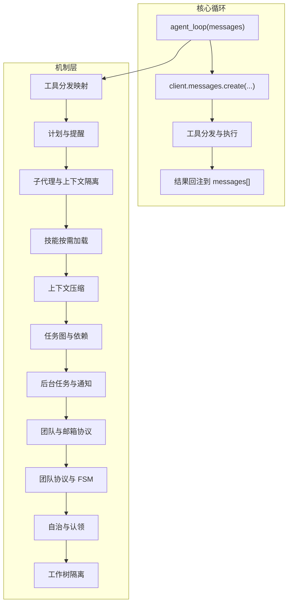
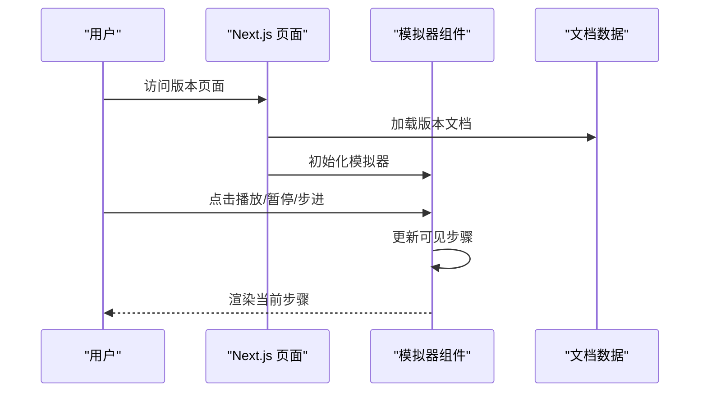
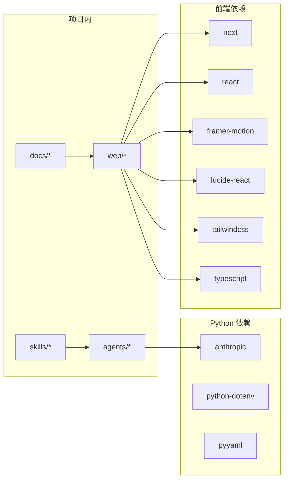

# 项目概述

<cite>
**本文档引用的文件**
- [README.md](file://README.md)
- [README-zh.md](file://README-zh.md)
- [requirements.txt](file://requirements.txt)
- [package.json](file://web/package.json)
- [agents/__init__.py](file://agents/__init__.py)
- [agents/s01_agent_loop.py](file://agents/s01_agent_loop.py)
- [agents/s02_tool_use.py](file://agents/s02_tool_use.py)
- [agents/s03_todo_write.py](file://agents/s03_todo_write.py)
- [web/src/app/[locale]/(learn)/[version]/page.tsx](file://web/src/app/[locale]/(learn)/(version)/page.tsx)
- [web/src/components/simulator/agent-loop-simulator.tsx](file://web/src/components/simulator/agent-loop-simulator.tsx)
- [web/src/lib/constants.ts](file://web/src/lib/constants.ts)
- [web/src/data/generated/docs.json](file://web/src/data/generated/docs.json)
- [skills/agent-builder/SKILL.md](file://skills/agent-builder/SKILL.md)
- [docs/zh/s01-the-agent-loop.md](file://docs/zh/s01-the-agent-loop.md)
</cite>

## 目录
1. [引言](#引言)
2. [项目结构](#项目结构)
3. [核心理念与设计哲学](#核心理念与设计哲学)
4. [架构总览](#架构总览)
5. [详细组件分析](#详细组件分析)
6. [依赖关系分析](#依赖关系分析)
7. [性能考量](#性能考量)
8. [故障排除指南](#故障排除指南)
9. [结论](#结论)
10. [附录](#附录)

## 引言
Learn Claude Code 是一个以“模型即代理，代码即工具箱”为核心理念的渐进式教学项目。该项目通过 12 个递进式课程，从最简单的代理循环逐步扩展到复杂的多代理协作与工作树隔离，帮助开发者理解如何构建有效的代理系统。项目强调“代理是模型”的根本认知，认为代理的本质在于模型的学习能力，而工程职责是构建合适的“工具箱”（Harness），使模型能够在特定领域中有效感知、推理与行动。

项目具有显著的教育性质与全栈架构特征：
- 教育性质：以心智模型优先的方式，通过“最小可行循环 + 逐层叠加机制”的方法论，帮助学习者从零理解代理工程。
- 全栈架构：包含 Python 代理实现（agents/）、交互式学习平台（web/）、技能库（skills/）与多语言文档（docs/）。

## 项目结构
项目采用模块化与渐进式教学相结合的组织方式：
- agents/：Python 参考实现，覆盖 s01–s12 与 s_full 总结版本，每个文件自包含且可直接运行。
- docs/{en,zh,ja}/：多语言文档，以“问题—方案—ASCII 图—最小代码”为结构，强调心智模型优先。
- web/：基于 Next.js 的交互式学习平台，提供可视化模拟器、源码查看器、文档渲染与学习路径导航。
- skills/：按需加载的技能知识库，支持在运行时注入领域知识。
- tests/：轻量级冒烟测试与背景任务验证。
- 根目录配置：requirements.txt（Python 依赖）、package.json（前端依赖与脚本）、CI 工作流等。

```mermaid
graph TB
subgraph "Python 代理实现"
A1["agents/s01_agent_loop.py"]
A2["agents/s02_tool_use.py"]
A3["agents/s03_todo_write.py"]
A4["agents/s04_subagent.py"]
A5["agents/s05_skill_loading.py"]
A6["agents/s06_context_compact.py"]
A7["agents/s07_task_system.py"]
A8["agents/s08_background_tasks.py"]
A9["agents/s09_agent_teams.py"]
A10["agents/s10_team_protocols.py"]
A11["agents/s11_autonomous_agents.py"]
A12["agents/s12_worktree_task_isolation.py"]
AF["agents/s_full.py"]
end
subgraph "Web 平台"
W1["Next.js 应用"]
W2["可视化模拟器"]
W3["源码查看器"]
W4["文档渲染"]
W5["学习路径导航"]
end
subgraph "技能与文档"
S1["skills/agent-builder/SKILL.md"]
D1["docs/zh/s01-the-agent-loop.md"]
D2["docs/en/*"]
D3["docs/ja/*"]
end
A1 --> W2
A2 --> W2
A3 --> W2
A4 --> W2
A5 --> W2
A6 --> W2
A7 --> W2
A8 --> W2
A9 --> W2
A10 --> W2
A11 --> W2
A12 --> W2
AF --> W2
W1 --> W2
W1 --> W3
W1 --> W4
W1 --> W5
S1 --> A5
D1 --> A1
D2 --> A1
D3 --> A1
```

图表来源
- [agents/s01_agent_loop.py:1-121](file://agents/s01_agent_loop.py#L1-L121)
- [web/src/components/simulator/agent-loop-simulator.tsx:1-97](file://web/src/components/simulator/agent-loop-simulator.tsx#L1-L97)
- [web/src/app/[locale]/(learn)/[version]/page.tsx](file://web/src/app/[locale]/(learn)/[version]/page.tsx#L1-L126)
- [skills/agent-builder/SKILL.md:1-130](file://skills/agent-builder/SKILL.md#L1-L130)
- [docs/zh/s01-the-agent-loop.md:1-119](file://docs/zh/s01-the-agent-loop.md#L1-L119)

章节来源
- [README.md:1-378](file://README.md#L1-L378)
- [README-zh.md:1-373](file://README-zh.md#L1-L373)
- [agents/__init__.py:1-4](file://agents/__init__.py#L1-L4)

## 核心理念与设计哲学
- 模型即代理：代理是经过训练的模型，而非框架、提示链或拖拽式工作流。工程的重心应放在“工具箱”（Harness）的设计与实现上，使模型能够感知环境、推理目标并采取行动。
- 工具箱思维：Harness = 工具 + 知识 + 观测 + 行动接口 + 权限。模型负责决策，代码负责执行；模型是驾驶员，工具箱是车辆。
- 渐进式教学：从“一个循环 + 一个工具”出发，逐层叠加机制（规划、知识、上下文压缩、任务系统、后台任务、团队协作、自治与隔离），最终形成可扩展的代理工程范式。
- 通用模式：项目愿景是“用真正的代理铺满宇宙”，将代理工程模式推广到农场管理、酒店运营、医疗研究、制造业、教育等多个领域。

章节来源
- [README.md:4-111](file://README.md#L4-L111)
- [README-zh.md:5-111](file://README-zh.md#L5-L111)

## 架构总览
项目采用“最小代理循环 + 机制叠加”的架构模式：
- 最小循环：一个 while 循环 + stop_reason 控制，模型决定是否调用工具，代码负责执行工具并将结果回注到上下文中。
- 机制叠加：每节课新增一个 Harness 机制（如工具分发、计划管理、知识按需加载、上下文压缩、任务图、后台任务、团队通信、自治与工作树隔离），但不改变核心循环。
- 可视化平台：Next.js 提供交互式学习体验，包括模拟器、源码查看、文档渲染与版本导航。

图表来源
- [README.md:190-218](file://README.md#L190-L218)
- [web/src/lib/constants.ts:9-29](file://web/src/lib/constants.ts#L9-L29)

章节来源
- [README.md:190-218](file://README.md#L190-L218)
- [web/src/lib/constants.ts:1-38](file://web/src/lib/constants.ts#L1-L38)

## 详细组件分析

### Python 代理实现（agents/）
- s01 代理循环：最简实现，展示“用户 → LLM → 工具 → 结果回注”的闭环。
- s02 工具使用：引入工具分发映射，新增 bash、read_file、write_file、edit_file 等工具。
- s03 TodoWrite：引入 TodoManager 与“nag 提醒”，强制模型在多步任务中保持计划性。
- s04 子代理：为复杂任务创建子代理，使用独立 messages[] 保持主对话清洁。
- s05 技能加载：按需加载技能知识，避免系统提示膨胀。
- s06 上下文压缩：三层压缩策略（微压缩、自动压缩、手动压缩）应对上下文窗口限制。
- s07 任务系统：文件持久化的任务图，支持依赖关系与状态流转。
- s08 后台任务：后台线程执行耗时操作，通过通知队列回注结果。
- s09 团队：持久化队友与异步邮箱，支持跨轮次通信。
- s10 团队协议：统一的请求-响应协议（shutdown/plan approval）。
- s11 自治代理：队友扫描任务板、自动认领任务，减少人工干预。
- s12 工作树隔离：每个任务绑定独立工作树目录，避免文件冲突。
- s_full：总纲实现，整合所有机制。

章节来源
- [agents/s01_agent_loop.py:1-121](file://agents/s01_agent_loop.py#L1-L121)
- [agents/s02_tool_use.py:1-151](file://agents/s02_tool_use.py#L1-L151)
- [agents/s03_todo_write.py:1-212](file://agents/s03_todo_write.py#L1-L212)

### Web 平台（Next.js）
- 版本页面：根据学习路径动态渲染版本详情、工具数量、核心新增与关键洞察。
- 可视化模拟器：按步骤展示代理循环与工具调用过程，支持播放/暂停/步进/速度控制。
- 源码查看器：展示对应版本的源码与差异对比。
- 文档渲染：从生成的 docs.json 中提取版本文档，支持多语言。
- 学习路径导航：提供前后版本跳转与层级标签（工具、规划、记忆、并发、协作）。

图表来源
- [web/src/app/[locale]/(learn)/[version]/page.tsx:1-L126](file://web/src/app/[locale]/(learn)/[version]/page.tsx#L1-L126)
- [web/src/components/simulator/agent-loop-simulator.tsx:1-97](file://web/src/components/simulator/agent-loop-simulator.tsx#L1-L97)
- [web/src/data/generated/docs.json:1-156](file://web/src/data/generated/docs.json#L1-L156)

章节来源
- [web/src/app/[locale]/(learn)/[version]/page.tsx:1-L126](file://web/src/app/[locale]/(learn)/[version]/page.tsx#L1-L126)
- [web/src/components/simulator/agent-loop-simulator.tsx:1-97](file://web/src/components/simulator/agent-loop-simulator.tsx#L1-L97)
- [web/src/lib/constants.ts:1-38](file://web/src/lib/constants.ts#L1-L38)

### 技能与知识注入（skills/agent-builder/SKILL.md）
- 设计哲学：模型已知如何成为代理，工程职责是提供机会（能力与知识），而非过度工程化。
- 三大要素：能力（原子动作）、知识（按需注入）、上下文（隔离与截断）。
- 域示例：业务（CRM 查询、邮件、日历、审批）、研究（数据库搜索、文档分析、引用）、运营（监控、工单、通知、升级）、创意（资产生成、编辑、协作、评审）。

章节来源
- [skills/agent-builder/SKILL.md:1-130](file://skills/agent-builder/SKILL.md#L1-L130)

### 文档与心智模型（docs/）
- 多语言文档：以“问题—方案—ASCII 图—最小代码”呈现，强调心智模型优先。
- 示例：s01 文档详细解释循环工作原理与变更内容，便于对照学习。

章节来源
- [docs/zh/s01-the-agent-loop.md:1-119](file://docs/zh/s01-the-agent-loop.md#L1-L119)

## 依赖关系分析
- Python 依赖：anthropic（LLM 客户端）、python-dotenv（环境变量）、pyyaml（YAML 处理）。
- 前端依赖：Next.js、React、Framer Motion、Lucide React、TailwindCSS、TypeScript 等。
- 项目内依赖：agents 与 web 通过版本号与学习路径建立耦合，文档与模拟器通过生成的数据进行解耦。

图表来源
- [requirements.txt:1-3](file://requirements.txt#L1-L3)
- [package.json:1-39](file://web/package.json#L1-L39)

章节来源
- [requirements.txt:1-3](file://requirements.txt#L1-L3)
- [package.json:1-39](file://web/package.json#L1-L39)

## 性能考量
- 上下文窗口管理：通过三层压缩策略（微压缩、自动压缩、手动压缩）控制 token 使用，避免超出上下文上限。
- 并发与后台任务：后台线程执行耗时操作，主线程继续思考，提升整体吞吐。
- 工作树隔离：任务级目录隔离减少文件冲突与回滚成本，提高稳定性。
- 可视化模拟器：按需加载场景数据，使用动画库优化渲染性能。

## 故障排除指南
- 环境变量：确保正确设置 ANTHROPIC_API_KEY，并在本地 .env 中配置 MODEL_ID。
- 权限与安全：工具调用包含危险命令拦截与路径沙箱，避免越权访问。
- 上下文溢出：遇到上下文过长导致失败时，优先使用压缩工具或减少一次性注入的信息量。
- 团队通信：检查邮箱文件夹是否存在与可读写，确认 JSONL 格式正确。
- 自治代理：若出现身份丢失，确认压缩后是否进行了身份重注入。

章节来源
- [agents/s01_agent_loop.py:65-78](file://agents/s01_agent_loop.py#L65-L78)
- [agents/s02_tool_use.py:41-46](file://agents/s02_tool_use.py#L41-L46)
- [agents/s06_context_compact.py:1-212](file://agents/s06_context_compact.py#L1-L212)
- [agents/s09_agent_teams.py:1-212](file://agents/s09_agent_teams.py#L1-L212)
- [agents/s11_autonomous_agents.py:1-212](file://agents/s11_autonomous_agents.py#L1-L212)

## 结论
Learn Claude Code 以“模型即代理，代码即工具箱”为核心理念，通过渐进式教学将复杂的代理系统分解为可理解、可复用的机制层。Python 实现与 Next.js 可视化平台相辅相成，既满足实践需求，又提供沉浸式学习体验。项目不仅教授如何构建代理，更重要的是传递一种工程思维：信任模型、简化循环、扩展工具箱、在安全边界内释放智能的潜力。

## 附录
- 学习路径概览（阶段划分与核心机制）：
  - 阶段一：循环与工具（s01–s02）
  - 阶段二：规划与知识（s03–s05）
  - 阶段三：持久化与上下文管理（s06–s07）
  - 阶段四：并发与团队协作（s08–s12）

章节来源
- [README.md:253-286](file://README.md#L253-L286)
- [README-zh.md:254-286](file://README-zh.md#L254-L286)